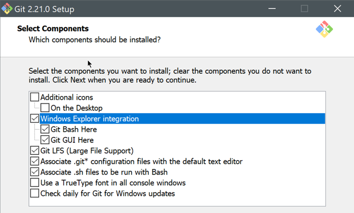

# Installeer Git 

## Check eerst of je git al hebt
* [open een cmd](../999_allerlei/linux_en_dos_commandos.md) 
* typ: git --version 
* Als dit niet lukt of als de versie veel ouder is dan de huidige versie van git dan moet je nu git installeren 

## Download en installeer 
* Windows: 
  * https://git-scm.com/downloads 
  * In de wizard:
    * Select Components >  Selecteer Windows Explorer integration (default opties):  
    
      
    * Default editor: kies bvb notepad++ (of notepad)
    * Laat verder alle defaults staan
* Mac: 
  * Best via de Homebrew package manager 
  * Installeer xcode command line tools - in terminal:    
    ```xcode-select –install```    
  * en volg de instructies 
  * Installeer homebrew - in terminal (op 1 lijn): 
    ```/usr/bin/ruby -e "$(curl -fsSL https://raw.githubusercontent.com/Homebrew/install/master/install)"```
  * Installeer git -- in terminal: 
    ```brew install git```
    
## Configureer git 
* * In Git Bash (Windows) of terminal (Mac) typ je:
```
git config --global user.name "<jouw naam>"
git config --global user.email <jouw e-mailadres>
git config --global init.defaultbranch main
```
Wat is dit? 
* **user.name** (en user.email) 
  * is de naam die je zal zien als je code commit.
  * **Let op**: als je op meerdere computers werkt let er dan op dat je dezelfde naam en email gebruikt op de verschillende computers.
* **init.defaultbranch** 
  * vroeger was naam van de default branch altijd master. Een paar jaar geleden is dit een verboden woord geworden en sindsdien beveelt git aan om dit woord niet meer te gebruiken. De nieuwe conventie is om als default naam "main" te gebruiken. 
* noot: values met een spatie of een ander special character zet je altijd tussen dubbele quotes
* check dit:
  ```git config –global -l```
* als je iets fout gezet hebt:
  ```git config –global -replace-all user.name "<new Name>"```


---
[prev](01_wat_is_git.md)
[next](03_git_bash.md)