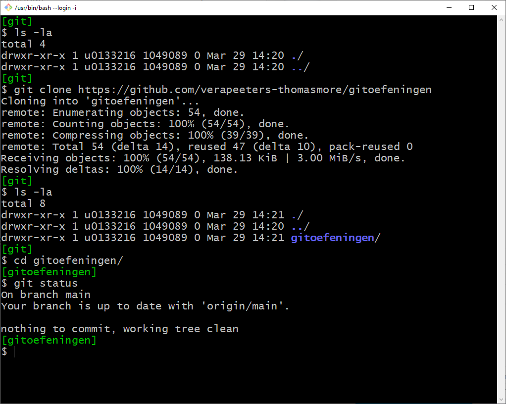

# Git bash

| CLI = Command Line Interface |
| --- |

| GUI = Graphical User Interface| 
| --- |

* We leren de basis van GIT aan met CLI
  * Gebruik CLI … tot je begrijpt wat je doet…
  * Later kan je GUI gebruiken

* Open nu Git Bash.
  * Tip: als je in de File Explorer rechts‐klikt kan je Git Bash openen in deze
directory
  * Dit is een linux‐achtige CLI. De meeste Linux command’s hebben een
    tegenhanger in een gewone cmd‐dox‐box. Een paar nuttige commando’s vind
    je in de appendix achteraan in dit document.
  * je kan de  git-commando's ook uitvoeren in het Terminal tool-window in IntelliJ of in een dos-cmd-box.    
* Mac user kunnen gewoon een Term gebruiken ipv Git Bash     

---
[prev](/02_installeer_git.md)
[next](/04_wat_is_een_git_repo.md)