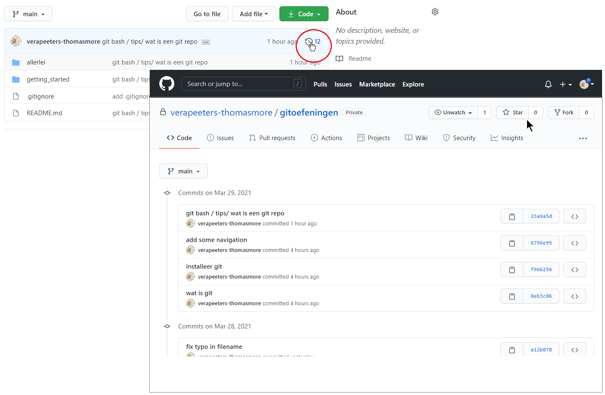
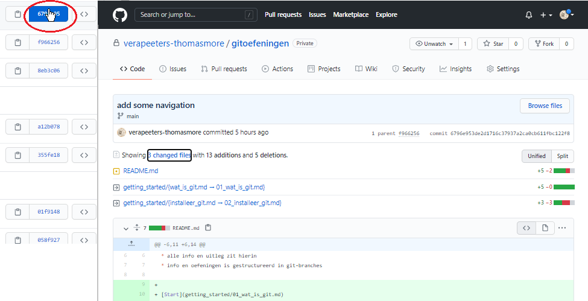

# Wat is een Git Repo? 

Om een idee te krijgen wat een repo is kijken we even rond in deze **Git Repo [gitoefeningen](../README.md) op GitHub**. 
* een git repo bevat gewoonlijk [plain text files](../999_allerlei/wat_is_md.md) (code is altijd plain text)
* de files zijn gestructureerd in **directories** (folders)
* je kan een file openklikken in github om de content te zien   
* Github gebruikt de file **[README.md](../README.md)** als info voor deze repo
* in de **[.gitignore](08_gitignore.md)** file staat welke files en directories nooit aan deze repo mogen toegevoegd worden  
* in Github  kan je gemakkelijk **zoeken** in alle files van een repo (Search of jump to...)
  
## history
* je ziet de **[history](../02_time_travel/01_history.md)** van de repo in Github:

  

* Voor elke stap (**commit**) in deze history kan je zien wat de aanpassingen waren:
  
  

* Als je hier op de "Browse files" knop klikt dan zie je de ganse file structuur terug zoals hij toen was 

## Branches
* je ziet ook verschillende **[branches](../05_branches/01_branches.md)** 
* noot: bekijk dit pas als je vlot kan werken met de basis begrippen (init, status, add, commit, push, clone) 

  

* Deze repo staat nu op GitHub. [Straks](../03_github/03_connect_with_existing_github_repo.md) zet je deze files ook op je eigen computer.
* Maar eerst leren we nog een paar basis begrippen [next](05_git_basis_met_git_bash.md)   

---
[prev](03_git_bash.md)
[next](05_git_basis_met_git_bash.md)