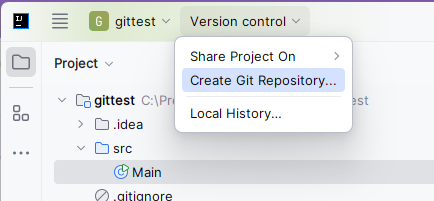
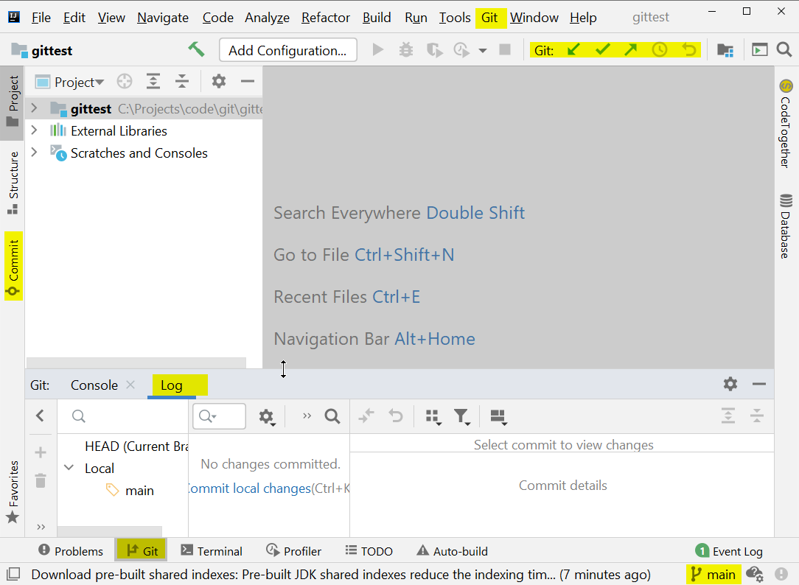
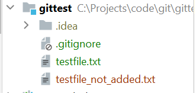
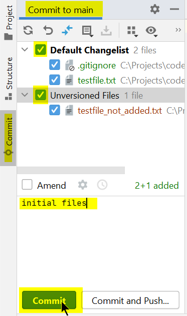
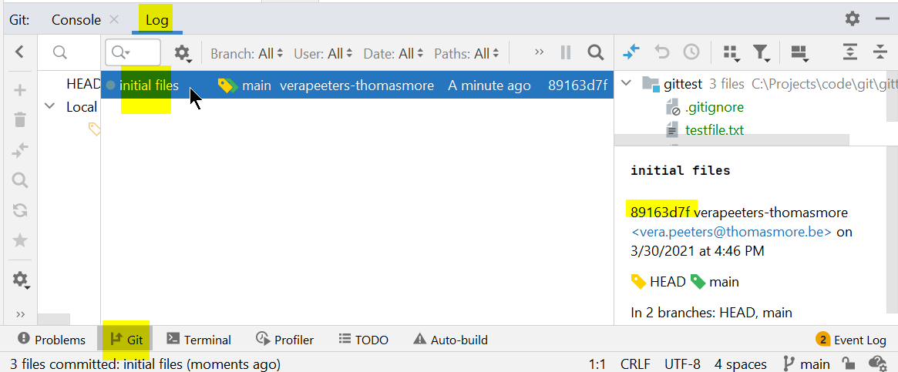

# Git Init: Je eerste git repository met IntelliJ 

## Open een project in IntelliJ 

* open een project in IntelliJ  
* als git nog niet geinitialiseerd is op deze directory dan zie je in IntelliJ in de menu niet "Git" maar wel "VCS". 
  En in de toolbar zie je dan geen git symbolen.
* Noot: VCS betekent "Version Control System"

Dit project is nog niet geinitialiseerd voor git: 


Als je deze directory bekijkt in de file explorer dan zie je dat er geen .git subdir is. 

## Initialiseer dit project voor git 

* noot: doe deze stap alleen als je project nog niet geinitialiseerd is voor git. 
* We zorgen er nu voor dat we git kunnen gebruiken in deze directory.
* met andere woorden: we maken van onze directory een **git repository**
* IntelliJ > menubar > VCS > Create Git repository > Kies de directory van dit project in IntelliJ 




IntelliJ ziet dat je project nu geinitialiseerd is voor git. 
Dit verandert wel veel voor je project in de user interface van IntelliJ: 


* Je ziet in het menu bovenaan dat de “**branch main**” actief is. In het eerste deel van deze bundel werken we met 1 branch
(main of master). Hierover later meer.
* noot: je default branch heet normaal gezien main als je de configuratie goed gedaan hebt na de [installatie van git](02_installeer_git.md)   
* In het "Git Tool Window" onderaan zie je: “No changes committed.”: dit betekent dat we nog geen commits gedaan hebben.
* We noemen je directory de “**working directory**”.
* Een **commit** is een **snapshot** van de working directory: daar zit alle info in waarmee je terug kan gaan naar de situatie op het moment van de commit. 

| je hebt nu een lokale git repository | 
|--------------------------------------| 

## .gitignore file 
* Als je met IntelliJ werkt moet je asap een [.gitignore](08_gitignore.md) file toevoegen aan je project.
* Maak in de root van je project een nieuwe file met naam .gitignore. 
* Git komt vragen of je deze file wil toevoegen in git, dat is OK. 
* Open deze file en voeg zeker deze 2 lijnen toe:
```
  .idea
  *.iml
```
* Voor sommige soorten projecten voorziet IntelliJ zelf al een .gitignore file. Je moet wel altijd nog deze 2 lijnen toevoegen. 
* Dit is nodig omdat we de IntelliJ configuratie zeker niet in git willen toevoegen

## Commits toevoegen aan je lokale repository 

* Er zit nog niets in je repository. Geen files (alleen .gitignore en .idea). Geen history.
* files in je working directory zijn ofwel:
  * **tracked**: wel gekend door git
  * **untracked**: niet gekend door git
* Maak een nieuwe file in je project. 
  Dit is eerst een untracked file. 
  Als Git komt vragen of je de files ook aan git wil toevoegen en je zegt OK dan wordt deze file onmiddellijk getracked.   
* IntelliJ toont untracked files in het rood en new added files in het groen.

  

* Open het Commit window (commit-knopje in de linker marge - of <CTRL>-k)
  
  

* selecteer alle files. Typ een commit message. Klik op de Commit button. 
* Hierdoor gebeurt er achter de schermen een "**git add**" en een "**git commit**
* Dus je voegt deze aanpassing toe aan de history van deze repo    
* In het "Git Log tool-window" onderaan zie je al je commits: Je ziet dat er nu 1 commit (snapshot) in de
repository zit.
  
  
  

  
* De “**commithash**” is een unieke id voor de commit van 40 characters lang
  * Bvb: ab4cbe9baa470609fb277047a26db4a7eaaa3c52.  
  * In IntelliJ zie je enkel de **eerste 8 chars** hiervan.  

## Oefening 
* Check telkens voor‐en‐na de situatie in het “git commit window” en in het “git log window”.
* Maak een aanpassing in de file en commit
* Voeg een tweede nieuwe file toe en commit
* Maak een aanpassing in de tweede file en commit

---
[prev](05_git_basis_met_git_bash.md)
[next](07_three_states.md)


