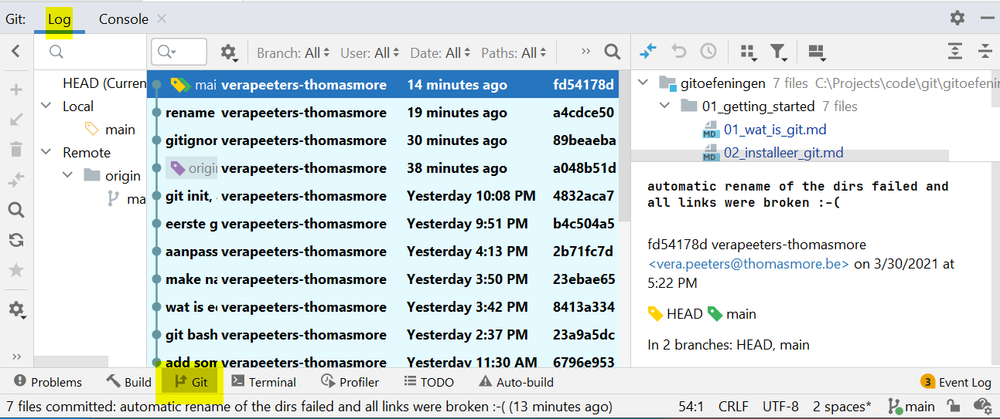

# History: Bekijk al je commits 

## In Git Bash: 
*  met het command "git log" kan je al je commits bekijken
```
  cd gittest
  git status
  git log
```


* een paar andere nuttige commando's:
  * git diff
    * je ziet de verschillen tussen de **working directory** en de **staging area** 
    * dus je ziet alle aanpassingen die je gedaan hebt en die nog niet gestaged zijn (ge-add)
  * git diff \<commithash>
    * changes in working directory vergeleken met de gekozen commit
  * git diff \<commithash> \<commithash>
    * changes tussen 2 commits
* probeer dit uit:     
  ```
  cd gittest
  git status
  git log
  git diff <commithash>
  git status
  <pas een file aan>
  git status
  git diff
  git add .
  git status
  git diff
  <pas opnieuw een file aan>
  git status
  git diff    
  ```

* Noot: na een aantal commits wordt de log lang. Heel lang.
  * Als de log langer is dan je bash‐window zal hetg stoppen en zie je een :
  * Nu kan je een <blank> tikken om verder te gaan en de rest an de log te zien
  * Of je kan een “q” tikken om te stoppen
  * Extra info: Git gebruikt het bash‐command “less” om de log te tonen. 
    Er zijn nog veel meer navigatie mogelijkheden. Type “less ‐‐help“


## In IntelliJ: 
* In IntelliJ zie je de log van je repository in het Git Tool Window onderaan:



* Als je een commit aanklikt zie je aan de rechterkant: 
  * welke files zijn aangepast
  * commit message en andere info (wie/wanneer) 
  * in welke [branches](../04_branches/branches.md) zit deze commit (later meer daarover)
* Als je aan de rechterkant op een file dubbel-klikt zie je de aanpassingen in deze file 
* Als je meerdere commits aanklikt dan zie je de aanpassingen gedaan in al die commits 


---
[prev](../01_getting_started/07_gitignore.md)
[next](02_go_back_in_time.md)
