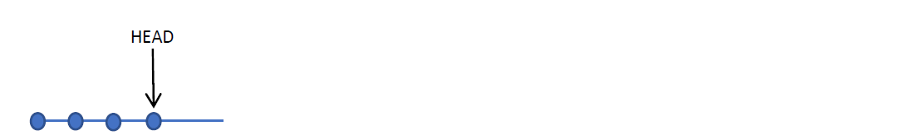
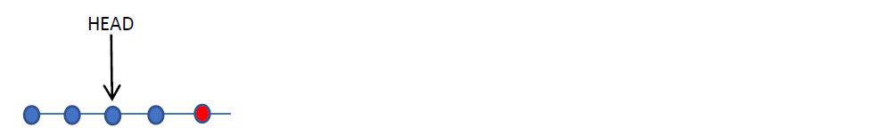

# Go back in time 

## Git checkout 
* Met het git commando "**git checkout**" kan je rondspringen in je commit history.
* Je gaat dan terug naar de status van je working directory zoals die was op het moment van die commit.
* let op: dit kan je niet doen als je working dir dirty is. Zorg er dus voor dat alle aangepaste files eerst gecommit zijn (of rollbacked) 

### In Git Bash: 
  ```
  cd gittest
  git status
  git log
  git checkout <commithash>
  git log
  ```

* let op: dit kan je niet doen als je working dir dirty is. Zorg er dus voor dat alle aangepaste files eerst gecommit zijn (of rollbacked)
* Bekijk de inhoud van je working directory (de files) 
* In de “git log” zie je nu alleen de commits tot en met de gekozen commit.
* Met het volgende commando kan je alle commits zien zelfs al is de laatste commit niet in je viewpoint: 
```
git log --all --graph --decorate
```

### In Intellij: 
* selecteer een commit 
* rechts-klik en selecteer "checkout Revision \<commit hash>" 
* let op: dit kan je niet doen als je working dir dirty is. Zorg er dus voor dat alle aangepaste files eerst gecommit zijn (of rollbacked)
* Bekijk de inhoud van je working directory (de files)

## Wat is HEAD? 

* De **HEAD** is je huidige gezichtspunt op je repository (point of view).
* met "git checkout" spring je naar een ander viewpoint. De HEAD revision wijst dan naar een andere commit. 
* We zullen later ook zien dat we met “git checkout” ook naar een andere branch kunnen springen.
* Je kan zien waar je HEAD staat met “git status”.
* In IntelliJ is de HEAD aangeduid met een **geel labeltje**



* Als je een **commit** doet, dan gaat HEAD naar deze nieuwe commit (want dat is je nieuwe
“point of view” na je commit).


* Na de “git checkout \<commithash>” zie je in git bash deze boodschap:

```
You are in 'detached HEAD' state. You can look around, make experimental changes
and commit them, and you can discard any commits you make in this state without
impacting any branches by performing another checkout.
```

* Als je het command "git status" nu gebruikt zie je : 
```
HEAD detached at 001961a
```

* je bent in **DETACHED HEAD** state 
* Dit betekent dat je geen commits kan doen.
* Want een commit wordt altijd toegevoegd na HEAD, maar… daar staat nu al iets… (the place
of the “next commit” is “already taken”).



## In IntelliJ: 
* je ziet rechts onderaan welk het actieve viewpoint is. 
* Als dit een **commit hash** is dan ben je in [DETACHED HEAD](Wat is HEAD?) state 
  * en dus kan je niet committen
  * om hieruit te geraken: 
    * selecteer de bovenste commit (of: de bovenste commit van een branch)
    * rechts-klik en selecteer "checkout branch..."  
* als dit een **branch** is (main of master of een andere branch) dan kan je wel committen 
* om uit DETACHED   doet, dan gaat HEAD naar deze nieuwe commit (want dat is je nieuwe
“point of view” na je commit).


## Hoe geraak je uit een detached head state? 
* Doe een checkout van een branch (dus niet van een commit): bvb van de default branch main (of master)
```
git checkout main
```

* Als je dit doet dan zal HEAD terug naar de laatste commit van branch master wijzen. En kan je terug committen.
  


* Check altijd welke branch actief is  
  * Git Bash: gebruik "git status" 
  * IntelliJ: rechts onderaan in de marge  

## Oefening
* doe een checkout van een commit 
* bekijk de inhoud van de files 
* doe een checkout van een andere commit 
* bekijk de inhoud van de files
* probeer een commit te doen -- dit faalt omdat je in detached head state zit
* doe een checkout van je main branch (of master als dat je default branch is)
* commit lukt nu terug 

---
[prev](01_history.md)
[next](03_undo_changes.md)
