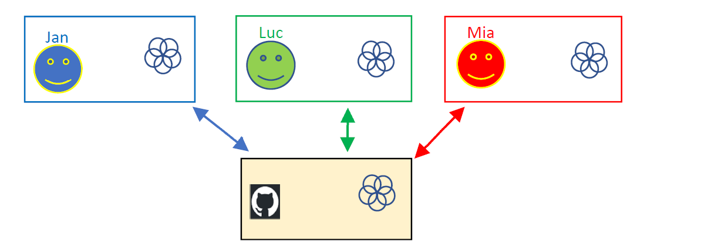

# Wat is Github? 

|GitHub is a Git repository hosting service|
|---|

* Dwz: Github is een plaats waar je repositories kan plaatsen zodat je deze kan sharen met je
teamleden.
* Andere repository hosting service platforms voor git zijn bitbucket, GitLab, AWS
  CodeCommit, … 
* Hoe gebruik je Github? 
  * Iemand van het team maakt een Github repository aan voor je project.
  * Iedereen in je team heeft een lokale git repository die gelinkt is met deze Github repository.
  * Iedereen houdt zijn code in sync met de repository op Github.  

* Zie ook: https://guides.github.com/ 

---
[prev](../02_time_travel/03_undo_changes.md)
[next](02_github_account.md)
