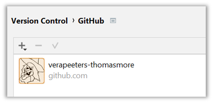

# Account op GitHub

## GitHub Account aanmaken 
* Maak een account aan op Github: https://github.com/ 
* Vraag een “student developer Pack” aan: https://education.github.com/pack 
* Met een "student developer Pack" krijg je een PRO account. Daarmee heb je meer mogelijkheden (bvb github pages)
* Je ziet of je een PRO account hebt op je hoofdpagina:  links onderaan onder Highlights
* Als je geen extra account wil maken voor je school-account dan kan je je school-email adres gewoon toevoegen aan je bestaande account. Dat is voldoende om "student developer Pack" aan te vragen  

## GitHub Account connecteren met IntelliJ 
* We willen IntelliJ rechten geven om vanalles te doen met onze GitHub account 
* Wanneer moet je dit doen: 
  * Als je de eerste keer een repo koppelt aan GitHub via IntelliJ
  * Of als het al lang geleden is dat je dat gedaan  hebt
  * Of als je een probleem ziet ivm **Bad credentials**
* IntelliJ > File > Settings > Version Control > GitHub 
* Kies + (add) en dan **Log in with Token** (dus niet met password!!!!!!!!) 
* In de “Add GitHub Account” dialog kies je “Generate…”
* In je browser wordt nu GitHub geopend op de Settings pagina waar je een “New personal access token” kan genereren.
* Merk op dat je in de browser op GitHub ingelogd bent – dus GitHub weet dat het genereren van het token veilig is
* Het “Note” field moet uniek zijn – dit is de “naam” van het token. Je mag dus nog geen andere tokens hebben met dezelfde naam. Ik voeg hier bvb de datum aan toe.
* Verder zijn alle defaults ok – Klik op button “Generate token” onderaan
* Op de volgende pagina zie je dan het token (in het groen). Copieer dit en paste het in de “Add Gitub Account” dialog.
* Als IntelliJ rechten heeft om je GitHub account te gebruiken zie je iets zoals dit in
  IntelliJ > Menu > Settings > Version Control > GitHub:

---
[prev](01_wat_is_github.md)
[next](03_connect_with_existing_github_repo.md)
