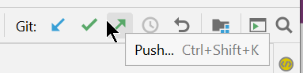

# Push

* Je local repo is nu geconnecteerd met een remote repo op Github
* Je kan nu de **commits** van je local repo **pushen** naar de remote repo
* let op: dit kan alleen als je rechten hebt op de remote repo
  * dus als je mijn repo gecloned hebt dan kan je dit niet doen
  * je kan wel mijn remote repo [forken](06_fork.md) op Github


## in Git Bash:
* Noot: de eerste keer dat je push doet voor een (branch in een) remote repo moet je extra parameters meegeven:
```
git push -u origin main 
```
* Noot: main is de default branch in mijn project - gebruik hier master als dat jouw default branch is
* Je ziet nu je files op je remote repo op Github
* de volgende keer moet je de extra argumenten niet meer meegeven
```
git push
```


## in IntelliJ:
* gebruik het push symbool in de toolbar 

  
* of: <CTRL>-<SHIFT>-k
* of: in het git-tool-window onderaan selecteer je de huidige branch, rechts-klik en kies Push 
* Je ziet nu je files op je remote repo op Github


## Oefening
* op je eigen repo: [connecteer met github](04_connect_existing_local_repo.md) als dat nog niet gedaan is 
* pas een file aan, add, commit, push
* check op github of je de files daar ziet 


---
[prev](04_connect_existing_local_repo.md)
[next](06_fork.md)


