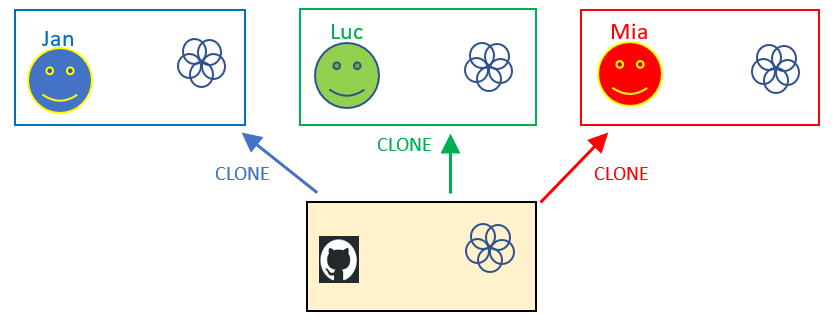
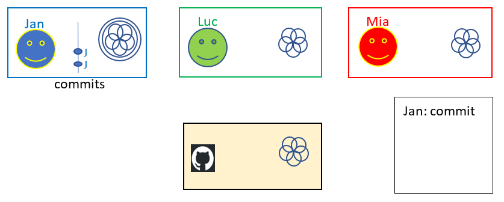
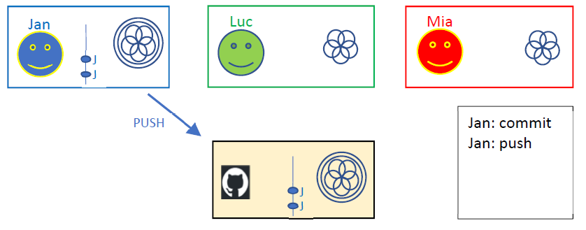
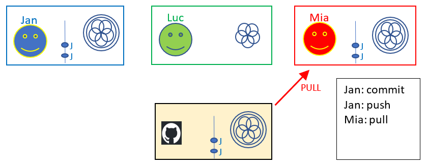
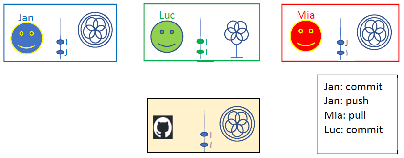
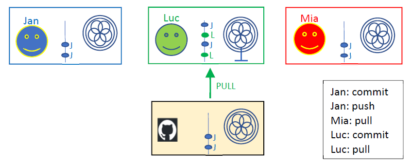
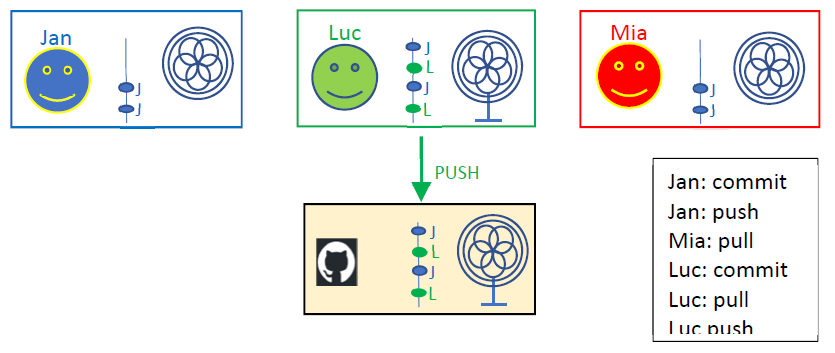

# Simpele Workflow

## Clone
* Iedereen in het team heeft een locale [clone](../01_getting_started/06_git_basis_met_intellij.md) van de repo die op github staat 
* Jullie hebben dus alemaal dezelfde code in je local repo
* We zeggen dat iedereen "**in sync**" is met de Github repository 

## Local changes en commit
* Als je code aanpast dan heb je “local changes” tegenover je local repo.
* Als je commit worden de local changes toegevoegd aan je local repo.
* Hiervan is nog niets zichtbaar voor je collega’s.
* Je kan wel zelf je lokale history (of logboek) zien (git log).

# Push 
* Als je pusht worden je lokale commits naar Github gestuurd waar je collega’s die
kunnen zien.
* Op Github zie je nu de nieuwe versie van je code, en ook al je individuele commits met hun
commit‐messages.
* Je collega’s zien nog niks hiervan op hun eigen local repo, ze moeten naar de
Github website gaan om jouw aanpassingen te kunnen zien.
  

  
# Pull 
* Je collega’s kunnen nu een pull doen. 
* Dit wil zeggen dat jouw aanpassingen nu ook  zichtbaar worden in hun lokale repository.
* We zeggen dat jouw changes **gemerged** worden in de local repo van je collega.

# Pull on a clean directory!

| Pull on a clean directory! |
|---|

* Je kan geen pull doen als je zelf aanpassingen hebt die nog niet gecommit zijn.
* met andere woorden: altijd eerst committen

|Commit before you pull!|
|---|

# Pull before you push!  

* Waarom: je collega's hebben ook al aanpassingen gedaan... 

|Pull before you push!|
|---|

* Luc heeft in zijn local repo al een paar commits gedaan. 
* Deze code is getest en ok. 
* **Luc wil zijn code pushen naar Github.** 
* Maar: Jan heeft al een paar commits gepusht.

* Luc doet eerst een pull
* Dus in de local repo van Luc zien we nu ook de aanpassingen van Jan (gemerged met die van Luc) 

* Luc test of deze gemergede versie van de code nog steeds werkt.
* Alles werkt nog 
* Luc doet een push, zodat ook zijn aanpassingen zichtbaar zijn in Github.

* Noot: Als je op school werkt met een **laptop** en thuis op een **desktop** dan kan je dit push en
pull systeem ook gebruiken om de code tussen je laptop en je desktop te syncroniseren.

## Samenvattin: Waarom altijd een pull voor een push? 
* De versie op de **gemeenschappelijke repo** moet altijd **stabiel** zijn (stable = geen errors).
* Daarom is de eerste stap altijd: **test** lokaal of je eigen code aanpassingen correct zijn.
* Maar… het is altijd mogelijk dat jouw aanpassingen niet meer werken als ze samenkomen
met de aanpassingen van je collega’s.
* De afspraak is dat je altijd eerst een **pull** doet en **test** op je lokale machine of de
gemergde versie werkt.
* Als je code werkte voordat je de pull deed en het werkt niet meer na de pull... dan is het jouw
verantwoordelijkheid om dat te **fixen**. 
* Maar je kan zien wie de laatste push gedaan heeft en hem **vragen** om te **helpen**.
* Noot: in ons geval is de gemeenschappelijke branch de default branch (main of master) – hierover later meer.

## Oefening 
* spreek af met 1 of meer mensen uit je klas en clone dezelfde repo op github
* bekijk welke problemen je tegenkomt en los samen op
* simpele push en pull   
  * persoon 1: maak local changes, commit, pull en push   
  * persoon 2: pull 
  * persoon 2: maak local changes, commit, pull en push
  * persoon 1: pull

## Oefening op je eentje 
* je kan dit eventueel ook op je eentje doen (maar dat is niet simpeler)
* clone dezelfde Github-repo 2 keer op je lokale machine 
* Je kan in elke clone files aanpassen en committen
* pull en push werkt dan op dezelfde manier als in een team 

---
[prev](../03_github/07_github_pages.md)
[next](02_merges.md)

