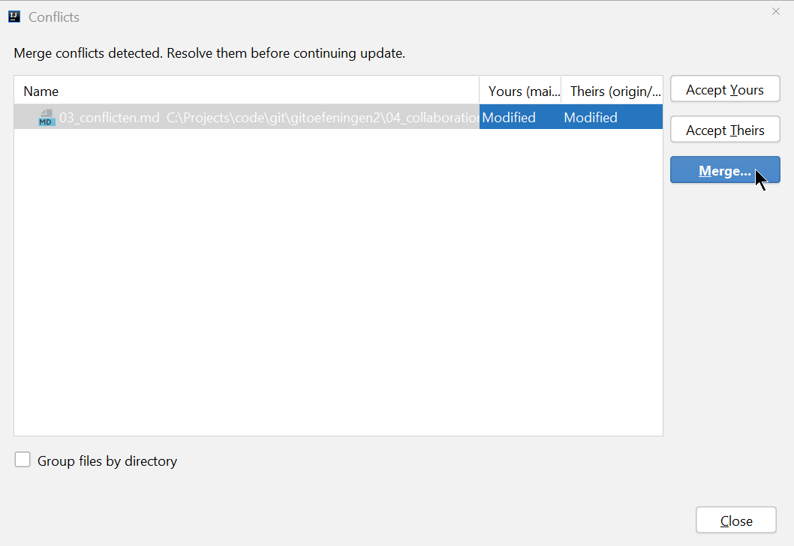
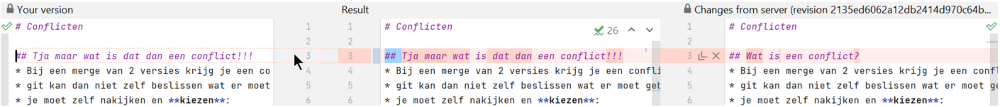
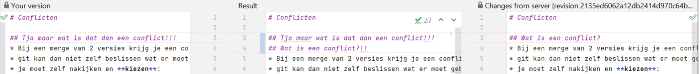
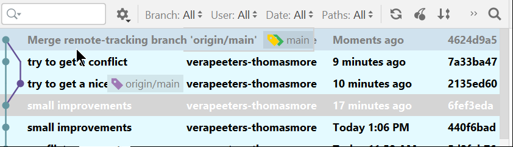
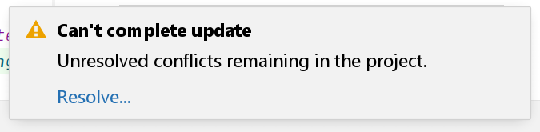

# Conflicten

## Wat is een conflict?
* Bij een merge van 2 versies krijg je een conflict als in de 2 versies een aanpassing gedaan is in dezelfde file en op dezelfde lijn. 
* git kan dan niet zelf beslissen wat er moet gebeuren 
* je moet zelf nakijken en **kiezen**:
  * wil je jouw aanpassingen
  * of de aanpasingen van de andere persoon
  * of allebei de aanpassingen
  * of moet je nog extra code aanpassingen doen om dit te laten werken
* Voor wat volgt raad ik wel aan om IntelliJ te gebruiken, of een andere tool waarmee je visuele merges kan doen.

## Hoe zie je dat er een conflict is? 
* Als je in IntelliJ een pull doet die een conflict veroorzaakt krijg je een duidelijke boodschap:

* We hebben hier 1 file met een conflict: 03_conflicten.md
* Noot: je kan ook een merge conflict krijgen als je een merge doet van 2 branches. Hierover later meer.  
* Dus je kan een merge van 2 versies hebben omwille van: 
  * pull
  * merge van branches

## Wat doe je bij een conflict 
* Kies zeker de optie **Merge**! 
* Als je "Accept Yours" kiest gooi je de changes die je collega gepushed heeft weg! (is meestal niet wat je wil) 
* Als je "Accept Theirs" kiest gooi je je eigen changes weg! (is meestal niet wat je wil)
* IntelliJ opent het **Merge venster**. 
* Noot: Je moet de conflicten oplossen voor elke file waarin een conflict zit.

## Wat zien we in het Merge venster?  

* Links: je eigen versie
* Rechts: de versie die je collega gepusht had
* In het midden: het resultaat
* Een conflict wordt in het rood gemarkeerd (hier op lijn 3) 
* Een change die geen conflict is wordt in het groen gemarkeerd (zo is er geen in dit voorbeeld). Die kan Git zelf oplossen. 
* Rechts bovenaan zie je dat erin dit voorbeeld 1 conflict is    
* Met de up/down pijltjes links bovenaan kan je naar de vorige/volgende change gaan (als er meerdere changes zijn) 

## Wat doe je in het Merge venster? 

* Meestal is het een goed idee om te starten met "Apply non-conflicting changes te kiezen (All)" (als er ook non-conflicting changes zijn - groene changes dus)
* Ga naar het eerste conflict 
* Je moet nu kiezen welke versie je wil houden: de linkse versie (jouw versie) of de rechtse versie (van je collega's) 
* In het IntelliJ merge tool moet je voor allebei de versies (links en rechts) aangeven of je dit wil houden of niet  
* In dit voorbeeld kies ik om ze allebei te houden
* Ik kies eerst de linkse versie 

* Deze change wordt dan toegepast in het middelste stuk (Result)

* Ik kies dus ook de rechtse versie

* Deze change wordt ook toegepast in het middelste stuk (Result)

  
* If check nog even het resultaat: 

  

* **Ik pas de tekst in het middelste venster nog aan tot ik het resultaat goed vind** 
* Dan duw ik op de **Apply** knop rechts onderaan 
* IntelliJ zal onmiddellijk deze merge committen (als alle conflicten geresolved zijn)
* In git log zie ik de nieuwe commit. De commit-message is "Merge remote-tracking branch 'origin/main'"
* Je ziet ook dat er vanaf mijn nieuwe commit nu 2 paden naar beneden lopen die de aparte gemergde commits bevatten 

* Belangrijk: Test steeds of alles nog werkt na een merge 

## Wat gebeurt er als je het conflict negeert 
* Dan zie je deze popup:

* als je die ook negeert:

* Je kan nu niet meer committen tot je het conflict oplost!  

## Oefening 
* spreek af met 1 of meer mensen uit je klas en clone dezelfde repo op github
* bekijk welke problemen je tegenkomt en los samen op
* changes in dezelfde file op dezelfde lijn 
  * persoon 1: maak een local change en commit
  * persoon 2: maak een local change _in dezelfde file en op dezelfde lijn_ en commit
  * persoon 1: pull en push
  * persoon 2: pull en push - **los het conflict op** 
  * persoon 1: pull
  * bekijk het resultaat in github en op je local repo
  
## Oefening op je eentje 
* je kan dit eventueel ook op je eentje doen (maar dat is niet simpeler)
* clone dezelfde Github-repo 2 keer op je lokale machine 
* Je kan in elke clone files aanpassen en committen
* pull en push werkt dan op dezelfde manier als in een team 

---
[prev](02_merges.md)
[next](04_conflicten_best_practices.md)

