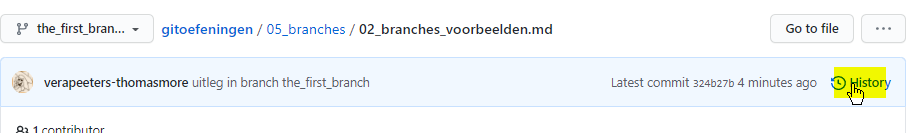
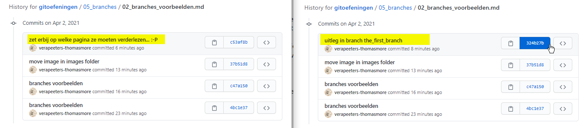

# Branches voorbeelden

## Op Github 

* In deze repo vind je verschillende branches
* bekijk eerst de branches op Github: 

* Je ziet: 
  * de default branch (main) is actief. 
  * dus als we op github naar de ([markdown](../999_allerlei/wat_is_md.md)) code kijken zien we de code zoals ze in deze branch zit.
  * er is nog 1 branch **the_first_branch** 
  * noot: op het moment dat jij naar de repo kijkt zijn er wellicht al meer branches. Op het moment dat ik dit schrijf is er 1. 
* Selecteer **in github** de branch **the_first_branch** 
  * In de branch **the_first_branch** gaat deze uitleg verder 
  * Als je terug de **main** branch selecteert zie je deze uitleg niet meer
  * deze uitleg is alleen gecommit in branch **the_first_branch**
* Kijk in Github naar de History (git log)    
  
  
  * Je ziet dan alleen de commits voor de geselecteerde branch 
  * Ik heb hier links de history van de main branch geopend en rechts de history van the_first_branch
  
  

  * de laatste gemeenschappelijk commit in de 2 branches is 37b51d8: "move image in images folder"
  * deze commit was "actief" (checkout) op het moment dat ik de branch gemaakt heb    
  * dan zijn er in allebei de branches nieuwe commits gedaan

## In IntelliJ 

* In IntelliJ zie je rechts onderaan dat branch main actief is  
* In het linker deel zie je welke branches gekend zijn: 
  * in de remote repo (origin) zijn er 2 branches: main en the_first_branch  
  * In de local repo heb ik alleen nog maar met branch main gewerkt
* In het middelste venster zie je de history van alle branches. 
* Als je hier een branch name selecteer zie je alleen de history van die branch. Dat heet geen invloed op de actieve branch 
* De commits die in de actieve branch zitten zijn gemarkeerd in lichtblauw
* De top van de branches wordt gemarkeerd door een labeltje: 
  * groen is een local branch 
  * purper is een remote branch  
  * geel is HEAD 
  
  


## In Git Bash
* welke branch is actief:
```
git status
```
* welke branches bestaan in local repo:
```
git branch
```
* welke branches bestaan in remote repo:
```
git branch -r
```
* alle branches:
```
git branch -a
```
* checkout: maak een branch actief 
```
git checkout <NAAM VAN DE BRANCH>
```


---
[prev](01_branches.md)
[next]()

