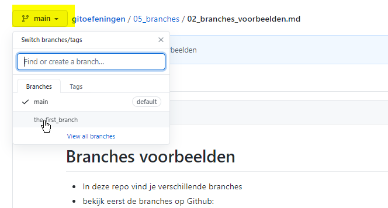

# Branches voorbeelden

* In deze repo vind je verschillende branches
* bekijk eerst de branches op Github: 

* Je ziet: 
  * de default branch (main) is actief. 
  * dus als we op github naar de ([markdown](../999_allerlei/wat_is_md.md)) code kijken zien we de code zoals ze in deze branch zit.
  * er is nog 1 branch **the_first_branch** 
  * noot: op het moment dat jij naar de repo kijkt zijn er wellicht al meer branches. Op het moment dat ik dit schrijf is er 1. 
* Selecteer **in github** de branch **the_first_branch**

---
[prev](01_branches.md)
[next]()

