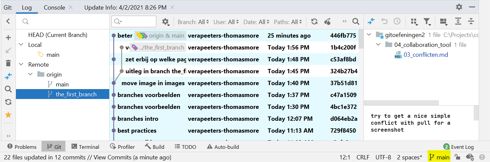
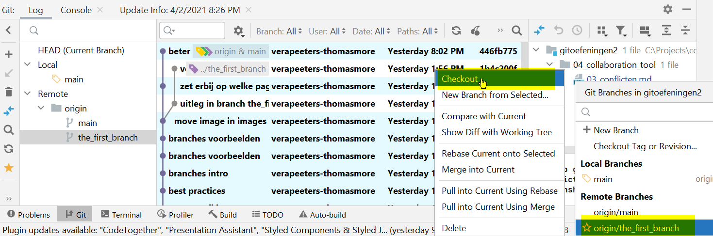
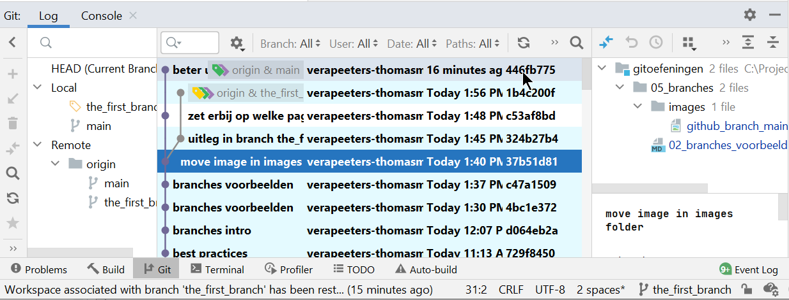
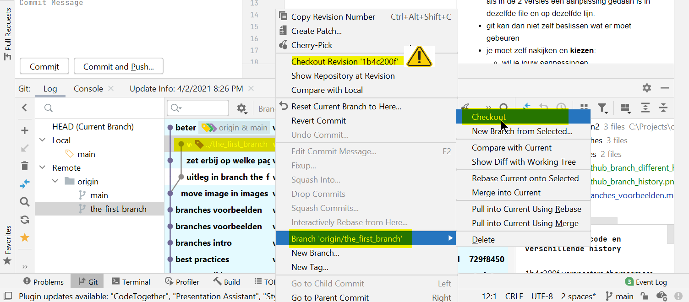

# Branches in local repo 

| Clone de repo |
|---|

## In IntelliJ 
* Clone de repo zodat die lokaal op je machine staat  
* Open de Git tab in de IntelliJ Tool windows

* In IntelliJ zie je rechts onderaan dat branch main actief is  
* In het linker deel zie je welke branches gekend zijn: 
  * In de local repo heb ik nog maar met 1 branch gewerkt: de default branch main
  * in de remote repo (origin) zijn er 2 branches: main en the_first_branch  
* In het middelste venster zie je de history van alle branches. 
* Je kan hier filteren op Branch, User, Date, Paths. De actieve branch blijft hetzelfde als je dit doet   
* De commits die in de actieve branch zitten zijn gemarkeerd in lichtblauw
* De top van de branches wordt gemarkeerd door een labeltje: 
  * groen is een local branch 
  * purper is een remote branch  
  * geel is HEAD: de top van de actieve branch 
* HEAD is: 
  * de status van de code zoals we die nu zien in de working dir  
  * de branch waar je commits zullen terechtkomen 
  * Noot: als HEAD niet de top van een actieve branch is dan kan je niet committen ([detached HEAD](../02_time_travel/02_go_back_in_time.md))   
  
* Checkout: maak een branch actief
* click op de naam van de actieve branch rechts onder, selecteer de branch die je wil en kies "Checkout"

  
* De actieve branch is nu the_first_branch: 

* Of: selecteer de branch in het linker deel van het Git Tool Window
* Of: selecteer een commit die bovenaan de branch staat, rechts klik, kies "Branch \<naam van de branch>", kies Checkout
* Let op: er is een verschil tussen checkout van een commit en checkout van een branch.  dat je checkout van een branch doet!  Bij checkout van een commit kom je in DETACHED HEAD.
  

## In Git Bash

| Git commando|wat doet het |
|---|---| 
| git status  | welke branch is actief | 
| git branch  |  welke branches bestaan in local repo | 
| git branch -r |  welke branches bestaan in remote repo | 
| git branch -a | alle branches (local en remote) | 
| git checkout \<NAAM VAN DE BRANCH> | checkout: maak een branch actief | 

## Oefening 
* git clone de repo (als je dat nog niet gedaan hebt) 
* bekijk de branches in IntelliJ en in Git Bash 

---
[prev](02_branches_voorbeelden.md)
[next](04_create_branch.md)

