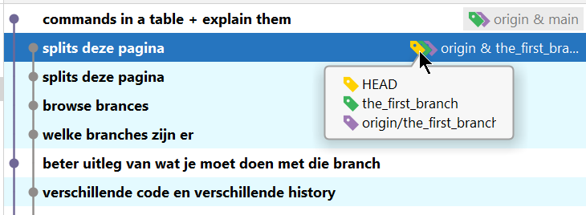
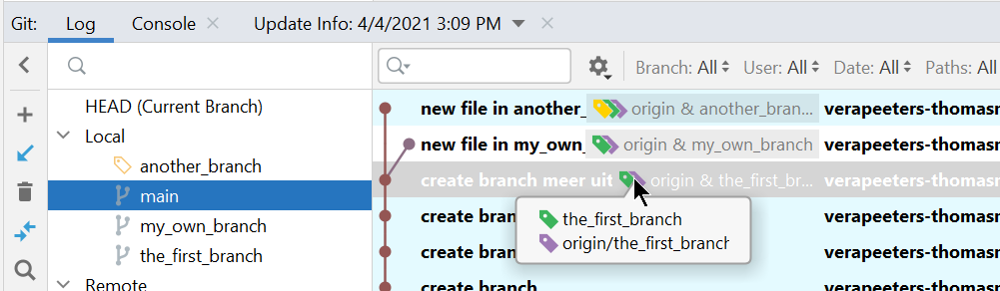

# Create new branch 

* voor deze en de volgende oefeningen maak je eerst:
    * een [fork](../03_github/06_fork.md) van de remote repo in github
    * een [clone](../03_github/03_connect_with_existing_github_repo.md) van de fork op je lokale machine
    * noot: je moet maar 1 fork maken voor alle oefeningen
* default wordt de branch aangemaakt op [HEAD](../02_time_travel/02_go_back_in_time.md) 
  * Dus: check eerst welke branch actief is en/of waar je HEAD staat
  * in Git Bash gebruik je "git status" om te kijken waar HEAD is    
  * in IntelliJ in de Git Log tab is HEAD gemarkeerd met een geel labeltje

    
## In IntelliJ: 
### No-nonsense 
* Noot: in IntelliJ zijn er verschillende mogelijkheden om een nieuwe branch aan te maken 
  * **let op**: soms doet IntelliJ eerst een checkout en dan een create branch
* dit werkt altijd:    
  * **Menu > Git > New Branch...**
  * zonder bijwerkingen (branch wordt gemaakt waar HEAD nu staat)
* Noot: automatische checkout van nieuwe branch 
  * je hebt in IntelliJ altijd de optie om onmiddellijk een checkout te doen van de nieuwe branch
  * als je "plain git" gebruikt (bvb in Git Bash) is dat een extra stap
* check in Git Log (history) waar het labeltje van de nieuwe branch staat 
* check of de nieuwe branch actief is 

### Commit en Push op nieuwe branch  
* Maak de nieuwe branch actief (checkout) zodat je commits op deze nieuwe branch terechtkomen
* Een push zal de commits van de **actieve branch** naar Github sturen (remote repo)    
* IntelliJ zorgt ervoor dat de **juiste opties** voor push gezet worden: de branch wordt gepusht naar een remote branch met dezelfde naam 
* als je "plain git" gebruikt (bvb in Git Bash) moet je dit expliciet installen (met de optie -u)
* Als de branch nog niet bestaat in de remote repo dan maakt git die aan 

### Andere manieren on branch aan te maken in IntelliJ  

* andere manieren zonder bijwerkingen:
  * Menu > Git > New Branch...
  * Menu > Git > Branches... > New Branch
  * klik rechts onderaan op de actieve branch name. Kies "New Branch"
* andere manieren met bijwerkingen (doet mogelijk eerst een checkout):
  * Branches Pane: 
    * Klik in het linker pane van het Git Tools Window op + (New Branch). 
    * **Let op**: selecteer eerst de branch vanwaar je wil starten. 
    * Als een andere branch geselecteerd is dan de actieve dan zal IntelliJ eerst een checkout doen
    * als je workspace dirty is zal IntelliJ klagen dat hij geen checkout kan doen 
  * via een Commit:
    * selecteer in het Git Log window een commit 
    * rechtsklik, selecteer "New Branch..."
    * als deze commit niet HEAD is, dan zal IntelliJ eerst een checkout doen van deze commit. Als je workspace dirty is zal IntelliJ klagen dat hij geen checkout kan doen.  
    * **Let op**: de nieuwe branch wordt gecreeerd vanaf deze commit. Dit kan ook als deze commit niet de top van een branch is. 

## In Git Bash:
```
git branch <NAAM VAN DE NIEUWE BRANCH>
git checkout <NAAM VAN DE NIEUWE BRANCH>
```
* je kan ook het aanmaken en de checkout in 1 stap doen met de optie **-b**: 
```
git branch -b <NAAM VAN DE NIEUWE BRANCH>
```
* Let op: de eerste keer dat je een nieuwe branch pusht moet je zeggen met **welke remote branch** je deze branch wil connecteren. 
* Normaal gezien gebruik je dezelfde naam voor local en remote branch
* Als de branch nog niet bestaat in de remote repo dan maakt git die aan

```
git push -u origin <NAAM VAN DE NIEUWE BRANCH>
``` 
* hier staat: ik push de current branch naar de remote repo "origin" en de naam van deze branch op de remote repo is \<NAAM VAN DE NIEUWE BRANCH>    
* dit moet je maar 1 keer doen. 

## Oefening
* my_own_branch
  * activeer (checkout) branch the_first_branch
  * maak een nieuwe branch my_own_branch en doe een checkout van de nieuwe branch   
  * push (zodat een lege nieuwe branch aangemaakt wordt in de remote repo)
  * maak een nieuwe file en zet er een lijn tekst in (best geen bestaande file editeren omdat we conflicten nog willen vermijden op dit moment)      
  * commit en push
  * bekijk de history (log) in IntelliJ en in GitHub 
* another_branch 
  * activeer opnieuw (checkout) branch the_first_branch
  * maak een nieuwe branch another_branch en doe een checkout van de nieuwe branch
  * push (zodat een lege nieuwe branch aangemaakt wordt in de remote repo)
  * maak een nieuwe file en zet er een lijn tekst in (best geen bestaande file editeren omdat we conflicten nog willen vermijden op dit moment)
  * commit en push
  * bekijk de history (log) in IntelliJ en in GitHub




---
[prev](03_branches_local_repo.md)
[next](04_simple_merge.md)
