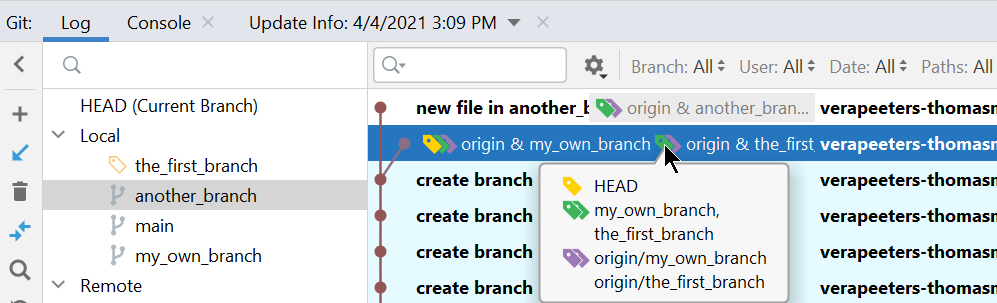
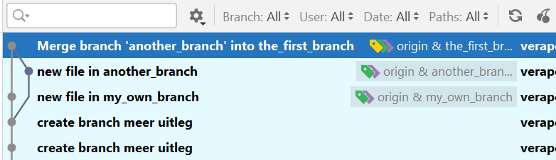
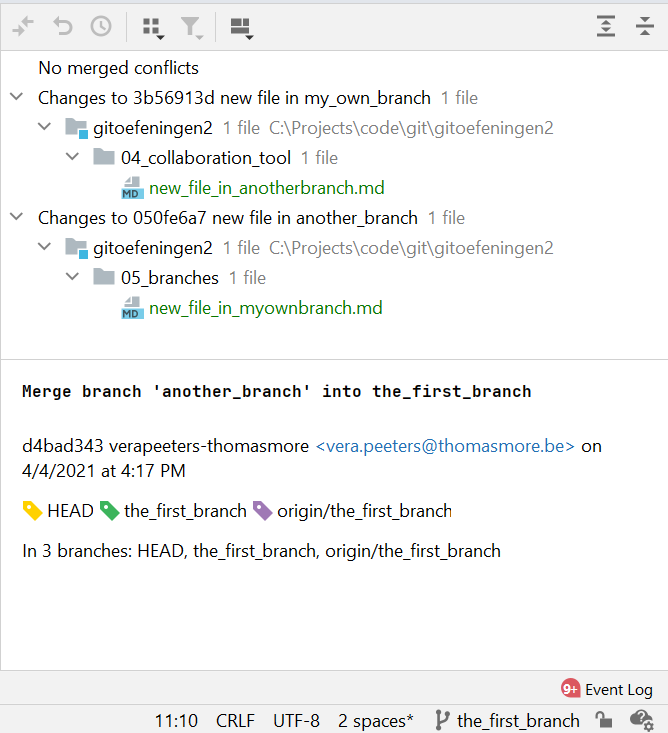

# Merge in a branch

* voor deze en de volgende oefeningen maak je eerst:
  * een [fork](../03_github/06_fork.md) van de remote repo in github
  * een [clone](../03_github/03_connect_with_existing_github_repo.md) van de fork op je lokale machine
  * noot: je moet maar 1 fork maken voor alle oefeningen
* voor deze oefening [maak je best eerst 2 branches](04_create_branch.md)

## Simpele merge
* merging principes zijn hetzelfde als bij [pull](../04_collaboration_tool/02_merges.md):
  * simpele merge: alle changes in verschillende files (volledig automatisch)
  * changes in dezelfde file maar op verscihllende lijnen (volledig automatisch)
  * changes in dezelfde file en op dezelfde lijn (conflict)

## Hoe merge je in IntelliJ
* maak eerst **de branch waarin je de aanpassing** wil doen actief (**checkout**)
* selecteer de branch die je wil mergen
* rechts-klik en kies "**Merge into Current**"

## Hoe merge je in Git Bash
* Als je weet dat dit een simpele merge wordt kan je het ook in Git Bash.
* Als je conflicten moet oplossen doe je dit beter met een visuele tool
* bijvoorbeeld: we mergen \<another_branch> in \<my_first_branch>
* maak eerst **de branch waarin je de aanpassing** wil doen actief (**checkout**)
```
git checkout <my_first_branch>
git merge <another_branch>  
```
* als blijkt dat je toch een conflict hebt kan je dit gaan resolven in IntelliJ (of een andere visuele tool)

## Oefening
* Dit zijn [merges zonder conflicten](../04_collaboration_tool/02_merges.md)
* merge de branch my_own_branch in the_first_branch
* push
* merge de branch another_branch in the_first_branch
* push

---
* status voor de merges:
  * de top-commit van the_first_branch staat op de 3e plaats
  * daarna is er een commit in my_own_branch
  * daarna is er een commit in another_branch
  * HEAD staat op de top van another_branch


---

* status na de **eerste** merge (+push)
  * de top-commit van the_first_branch staat nu op de 2e plaats
  * dit is ook de top-commit van my_own_branch
  * daarna is er nog 1 commit in another_branch
  * HEAD staat op de top van the_first_branch (en van my_own_branch)



---  

* status na de **tweede** merge (+push)
  * de top-commit van the_first_branch staat nu op de 1e plaats
  * dit is een **nieuwe extra commit**!!!
    * message is: "Merge branch 'another_branch' into the_first_branch"
    * deze commit is de "parent-commit" van de 2 gemergde branches
  * HEAD staat op de top van the_first_branch
  


---

* bekijk de changes in de merge-commit: dit is een samenvatting van de changes van de 2 branches

  


---
[prev](03_branches_local_repo.md)
[next]()

