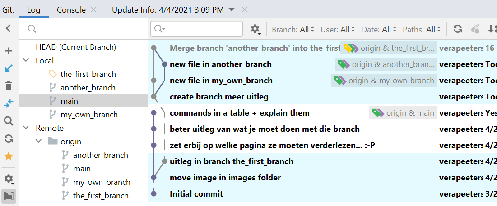
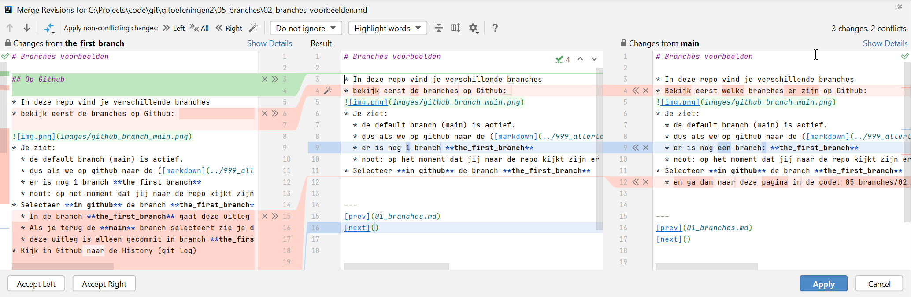
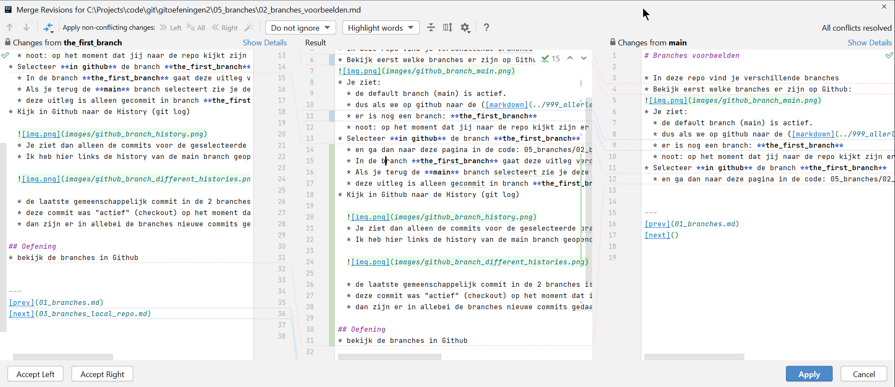
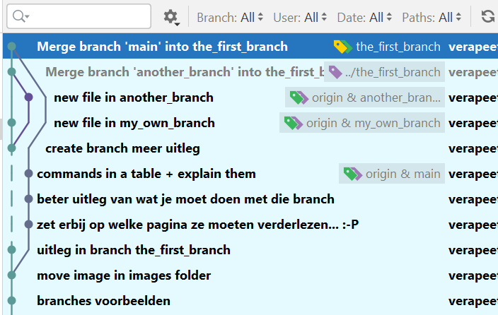

# Merge with conflicts 

* voor deze en de volgende oefeningen maak je eerst:
    * een [fork](../03_github/06_fork.md) van de remote repo in github
    * een [clone](../03_github/03_connect_with_existing_github_repo.md) van de fork op je lokale machine
    * noot: je moet maar 1 fork maken voor alle oefeningen

## Oefening
* In de branch **main** zijn er een paar aanpassingen die niet in branch **the_first_branch** zitten
* Welke aanpassingen zijn dat? Zoek ze op.
* Bekijk deze aanpassingen
* Tip: in IntelliJ:
    * Selecteer al deze changes in de Log tab (met control-click)
    * Je ziet aan de rechterkant welke files aangepast zijn **voor deze 3 changes**
    * Dubbelklik de files: je ziet de diffs voor **al de geselecteerde changes** in deze file
* Tip: in IntelliJ: 
    * je kan delen van branches "hiden" door op de bolletjes van de commits te klikken 
* Merge de changes van branch main in de branch the_first_branch
    * Dit is een [merge met conflicten](../04_collaboration_tool/03_conflicten.md) 
    * Activeer (checkout) de branch waarin je iets wil aanpassen: the_first_branch
    * selecteer de main branch, rechts-klik,

---
* status voor de merge (met een aantal commits gecollapsed voor de duidelijkheid)

---
* conflict!!! 
* Kies hier altijd "Merge" 

---
* [Conflict solving](../04_collaboration_tool/03_conflicten.md) in IntelliJ 
* Kies voor elke change links **en** rechts of je deze change wil houden of niet 
* Je kan ook nog het resultaat editeren

---
* Dit is bij mij het resultaat
* Als je tevreden bent klik dan op "Apply" om de merge voor deze file te eindigen 

---

* History na de merge (met sommige delen van de branches gecollapsed)

  

---
[prev](05_simple_merge.md)
[next](07_pull_before_push.md)

