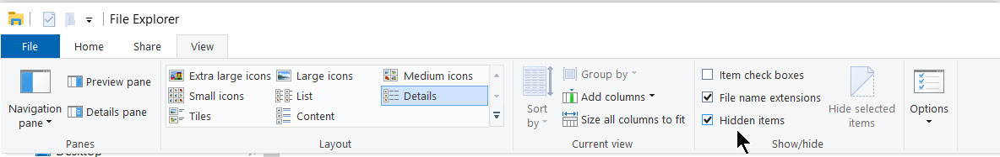

# Tips

* **Tip**: Maak ergens een basis directory waaronder je al je programmeer projecten zet.
  * Bvb (windows): “c:/Projects” of “c:/Users/<MIJNUSERNAME>/Projects”
  * Bvb (mac): “/home/Projects”
o Zet deze Projects directory zeker niet onder “Documents” of “Downloads” of
“Program Files”.
* **Tip**: configureer je file explorer zodat je “hidden files” en “file extensions” altijd ziet.

  
## Terminologie

* de **root** van je project = de basis directory van je project  