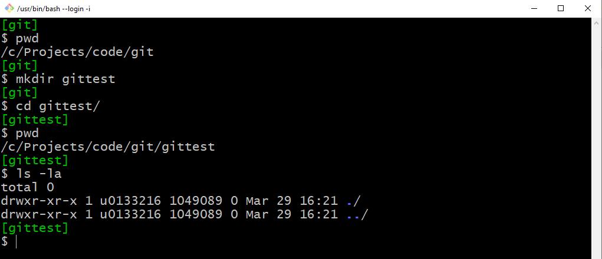
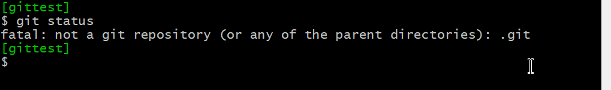
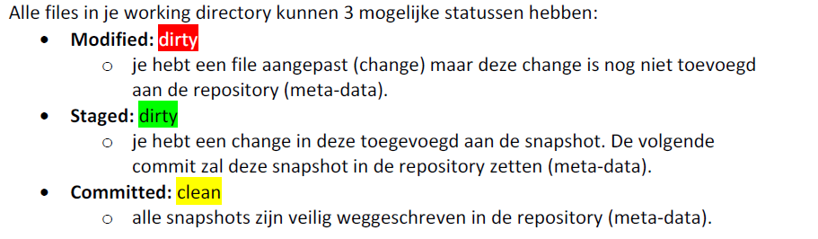
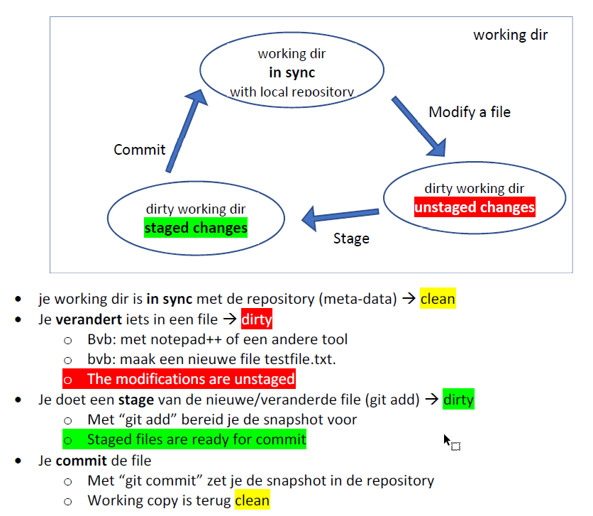

# Git Init: Je eerste git repository

## Maak een lokale directory (folder) 
* Waar maak je deze directory? Zie [tips](../allerlei/tips.md)
* Maak een nieuwe directory (folder)
  * bvb in de file-explorer 
  * je kan dit ook in Git Bash: start op de parent directory, dus de directory waarin je de nieuwe dir wil maken. 
  * Ik maak bvb een nieuwe dir "gittest" in de parent dir "c:/Projects/code/git". Dus mijn nieuwe dir is "**c:/Projects/code/git/git_init_mkdir**"      



* zie ook [linux en dos commando's](../allerlei/linux_en_dos_commandos.md)
* **pwd** = print working directory = huidige dir 
* **mkdir** = make new directory   
* **cd** = change directory (ga naar deze dir) 
* **ls** =  welke files staan in de huidige dir   
* **ls -la** = toon meer detail over de files (-l) en toon ook de hidden files (-a) 
* de directory is leeg: we zien enkel “.” (de huidige
  directory) en “..” (de parent directory).  
* check dit ook in file explorer

| je hebt nu een lokale directory | 
|---| 

* git werkt nog niet op deze directory. Als je het commando "git status" intikt dan krijg je een error.



## initialiseer deze directory voor git 
 ```
 git init
 git status
 ``` 


* We zorgen er nu voor dat we git kunnen gebruiken in deze directory.
* met andere woorden: we maken van onze directory een **git repository** 
* het git commando "git status" zegt je wat de status is van de repository


* Je ziet: “On branch main”: in het eerste deel van deze bundel werken we met 1 branch
(main). Hierover later meer.
* noot: in sommige versies van git is de default branch master ipv main
* Je ziet: “No commits yet”: dit betekent dat we nog geen commits gedaan hebben.
* We noemen je directory de “**working directory**”.
* Een **commit** is een **snapshot** van de working directory.

| je hebt nu een lokale repository | 
|---| 

## Commits toevoegen aan je lokale repository 

* Er zit nog niets in je repository. Geen files. Geen history.
* files in je working directory zijn ofwel:
  * **tracked**  wel gekend door git
  * **untracked**  niet gekend door git
* Maak een nieuwe file in je dir gittest. Dit is dus een untracked file.
* **Note**: Hoe maak je een nieuwe file?
  * Doe dit gewoon in je file explorer (new text file)
  * of je kan ook een file maken met het linux‐commando touch:
```touch <filename>```
* Note: Ik begin deze oefeningen altijd met ```cd gittest``` om expliciet aan te geven dat
  je dit in de directory gittest moet doen. 
* Voer nu de volgende commando’s uit in git‐bash:
```
cd gittest
git status
```
maak nu een file of pas een bestaande file aan
```
git status
git add testfile.txt
git status
git commit -m “add first file”
git status
git log
```

* Het “**git add**” commando maakt van deze file een tracked file.
* We zeggen ook dat je een “stage” doet.
* Het "**git commit**" voegt deze change toe aan de history van deze repo    
* Het “**git log**” zie je al je commits: Je ziet dat er nu 1 commit (snapshot) in de
repository zit.
* De “**commithash**” is een unieke id voor de commit van 40 characters lang
  * Bvb: ab4cbe9baa470609fb277047a26db4a7eaaa3c52
* **Noot**: Je kan ook een add (stage) doen voor alle changes in 1 keer: 
```
    cd gittest
    git status
```
verander iets in een file 
```
    git status
```
verander iets in een andere file
```
  git add .
  git status
```
* **Note**:
  * git add * adds alle files in deze directory
  * git add . adds alle files in deze repository (ook in subdirectories)  

## Three States 



## De Git workflow 



## Oefening 
* Check telkens voor‐en‐na de situatie met “git status” en “git log”.
* Maak een aanpassing in de file en commit
* Voeg een tweede nieuwe file toe en commit
* Maak een aanpassing in de tweede file en commit

---
[prev](../getting_started/04_wat_is_een_git_repo.md)
[next](../README.md)


