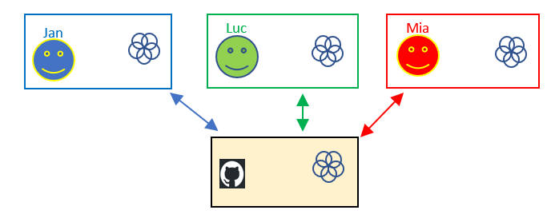

# Wat is Git? 

| Git is een versie controle systeem (of source controle systeem). |
| -----	| 

* Je bouwt een history op van je source code:
  * **Wat** is aangepast in de code door **wie** en **wanneer** en **waarom**
  * Je kan teruggaan naar een vorige versie (van voor een bepaalde aanpassing). 
  * bvb om te kijken waarom die versie nog wel werkt en de laatste versie niet meer
* Je deelt je code aanpassingen met je team
  * Je werkt op een **lokale** versie
  * Als je klaar bent met een aanpassing **commit** je
    * zodat je voor jezelf een history hebt waarop je kan terug vallen als er iets misloopt
  * Als je klaar bent met een aantal aanpassingen en je hebt dit getest dan **push** je
    * zodat iedereen in je team je aanpassingen kan zien
  * je doet regelmatig een **pull** 
    * zodat je alle aanpassingen van je team ook ziet 

* Waarvoor gebruiken wij git?
  * Q1: Project Management: 
      * aanleren en inoefenen
  * Q2: Object Oriented Programming:
      * ophalen van de oplossingen
  * Q3: Advanced Programming Techniques:
      * Git en Github
      * Slechts 1 persoon
      * Branches
    *  Voorbeeld applicatie van docent wordt ook op Github gepubliceerd
  * Q4: Projecten voor het werkveld
    * Git en Github
    * Team
    * Workflow met branches per feature

* **Noot**: De meeste bedrijven werken met een versie controle systeem.
    * Git is tegenwoordig het meest gebruikte.
    * Andere versie controle systemen zijn Mercurial, SVN (Subversion), CVS, Clearcase, ... 

* Zie ook
  * https://webo.7wn.be/slides/01.03.version-control (presentatie van Lars De Richter)
  * https://learngitbranching.js.org
  * https://git-scm.com/book/en/v2/Getting-Started-About-Version-Control
  * https://www.youtube.com/watch?v=2sjqTHE0zok&feature=youtu.be
