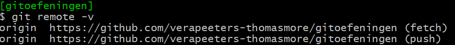
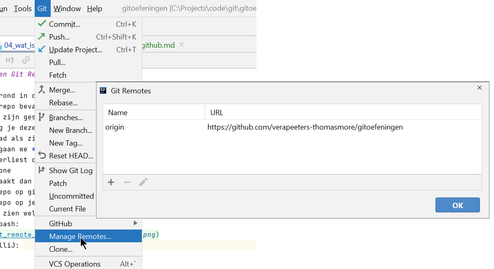

# Wat is GitHub? 

* wat is git clone? 
    * je maakt dan een lokale git repo die verbonden blijft met de repo op github
    * alle meta-data van de repo (zoals de history) blijft behouden in de lokale repo.   
    * de repo op github is de **remote repository**
    * de repo op je eigen computer is de **local repository**
* hoe     
    

* je kan zien welke remote repo verbonden is met een repo op je computer:
    * git bash:
      
    * IntelliJ:
      

---
[prev](../README.md)
[next](../README.md)
